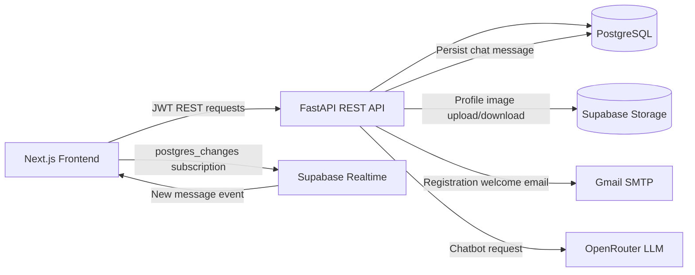
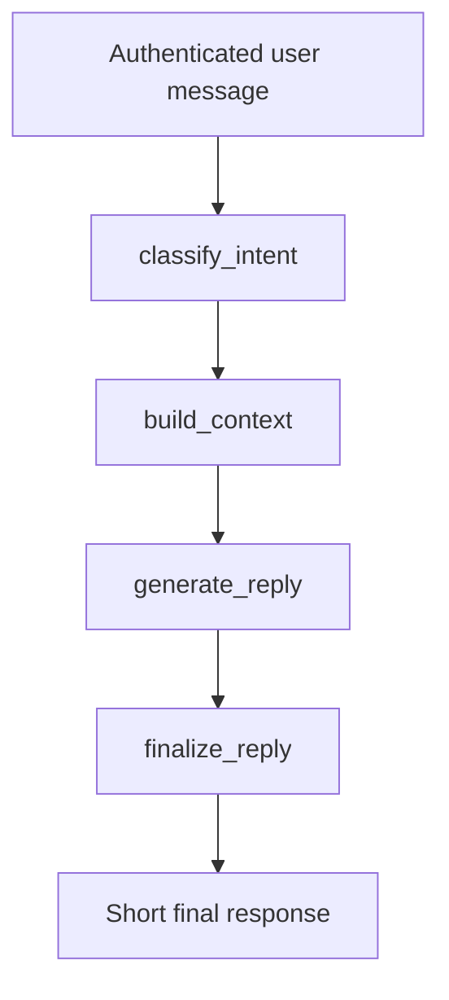

# InternConnect

> A full-stack internship coordination platform connecting students and teachers through internship discovery, application tracking, live messaging, AI assistance, and profile management.

InternConnect is designed for academic internship workflows. Students discover opportunities and track applications, while teachers publish internships, review candidates, update application statuses, communicate with students, and export applicant data.

## Contents

- [What It Does](#what-it-does)
- [Architecture](#architecture)
- [Technology Stack](#technology-stack)
- [Core Workflows](#core-workflows)
- [Chat Architecture](#chat-architecture)
- [LangGraph Chatbot](#langgraph-chatbot)
- [Email Service](#email-service)
- [Profile Images and Storage](#profile-images-and-storage)
- [Repository Structure](#repository-structure)
- [Local Development](#local-development)
- [Environment Variables](#environment-variables)
- [Database and Migrations](#database-and-migrations)
- [API Overview](#api-overview)
- [Deployment](#deployment)
- [Validation](#validation)
- [Security Notes](#security-notes)
- [Troubleshooting](#troubleshooting)
- [Roadmap](#roadmap)

## What It Does

### Student capabilities

- Create and manage a student profile.
- Upload a profile picture.
- Browse and search internship opportunities.
- Apply to an internship once and prevent duplicate applications.
- Continue to the company or external application URL.
- Track application status and applied date.
- Withdraw applications while they are still pending.
- Message teachers in real time.
- Ask the AI assistant questions about the platform and internships.

### Teacher capabilities

- Create and manage internship opportunities.
- View applicant counts from real application records.
- Search, sort, and review applicants.
- Update application status:
  `pending`, `reviewing`, `interview`, `accepted`, or `rejected`.
- Download applicant spreadsheets containing student details, status, and applied date.
- Message students.
- Manage a teacher profile and profile picture.

### Platform capabilities

- JWT authentication with student and teacher roles.
- PostgreSQL persistence through SQLAlchemy.
- Supabase Storage for profile images.
- Supabase Realtime for live chat updates.
- Gmail SMTP welcome emails after registration.
- LangGraph-powered AI chatbot backed by OpenRouter.
- Docker-based local deployment support.
- Health endpoint for backend/database availability checks.

## Architecture



### Responsibility boundaries

| Concern | Responsibility | Primary implementation |
| --- | --- | --- |
| UI and routing | Pages, dashboards, forms, loading states | Next.js App Router |
| Business API | Authentication, users, internships, applications, chat | FastAPI |
| Relational data | Users, roles, internships, applications, rooms, messages | PostgreSQL + SQLAlchemy |
| Image files | Profile image storage and retrieval | Supabase Storage |
| Live updates | New chat message notifications | Supabase Realtime |
| AI responses | Intent classification and response generation | LangGraph + OpenRouter |
| Registration email | Welcome email delivery | FastAPI-Mail + Gmail SMTP |

Supabase is not the primary application API. FastAPI remains the business-logic and write path for chat, applications, and user data. Supabase Realtime supplements the REST flow by notifying the frontend about newly inserted chat messages.

## Technology Stack

### Frontend

- Next.js 15 with the App Router.
- React and TypeScript.
- Tailwind CSS and shared UI components.
- `lucide-react` icons.
- Supabase JavaScript client for Realtime subscriptions.

### Backend

- Python and FastAPI.
- SQLAlchemy ORM.
- PostgreSQL, including Supabase-hosted PostgreSQL support.
- Pydantic request and response schemas.
- JWT bearer authentication.
- FastAPI-Mail and `aiosmtplib` for SMTP delivery.
- OpenPyXL for applicant spreadsheets.
- Pillow for image normalization.
- HTTPX for OpenRouter requests.
- LangGraph for chatbot orchestration.

### Infrastructure

- Render or another Python host for the API.
- Vercel or another Node host for the frontend.
- Docker and Docker Compose for local containerized development.
- Supabase Storage and Realtime.

## Core Workflows

### Registration and authentication

```text
Registration form
      |
      v
POST /users/
      |
      +--> Hash password with bcrypt
      +--> Create Student or Teacher record
      +--> Send welcome email through Gmail SMTP
      +--> Return created profile

Login form
      |
      v
POST /login
      |
      v
JWT access token
      |
      v
Frontend stores token and sends Bearer authentication
```

Registration remains successful if email delivery fails. The backend logs the SMTP failure so account creation is not coupled to the availability of Gmail.

### Internship and application lifecycle

```text
Teacher creates internship
          |
          v
Student views opportunity
          |
          v
Student clicks Apply Now
          |
          +--> POST /enroll creates a pending application
          +--> Browser opens the external application link
          |
          v
Teacher reviews application
          |
          v
Teacher updates status
          |
          v
Student sees current status
```

Applications are stored in the `enrolled` table. The table represents an application relationship between a student and an internship and includes:

- `student_id`
- `internship_id`
- `enrolled_at`
- `status`
- `updated_at`

The student/internship pair is unique, preventing duplicate applications.

The external company application page is outside InternConnect. InternConnect records and tracks the platform application event but cannot verify whether a student completed the external form.

### Applicant export

Teachers can export applicants for internships they own. The spreadsheet includes:

- SAP ID
- Name
- Email
- Department
- Roll number
- CGPA
- Application status
- Applied date

Applicant and export endpoints enforce teacher ownership of the internship.

## Chat Architecture

InternConnect uses a hybrid REST plus Realtime design.

### Write and persistence path

1. A user opens or creates a conversation.
2. FastAPI creates a two-user chat room if one does not already exist.
3. The sender posts a message through the FastAPI REST endpoint.
4. FastAPI verifies room participation.
5. The message is inserted into PostgreSQL.
6. The API response immediately updates the sender's UI.

The database models are:

- `chat_rooms`: conversation metadata.
- `chat_room_participants`: room membership join table.
- `chat_messages`: message body, sender, timestamp, and read state.

### Live update path

The messages page subscribes to Supabase Realtime `postgres_changes` events for `INSERT` operations on `public.chat_messages`, filtered by the active `chat_room_id`.

```text
Student sends message
        |
        v
FastAPI validates and writes PostgreSQL row
        |
        +--> REST response updates sender
        |
        +--> Supabase Realtime publishes INSERT
                    |
                    v
              Recipient UI appends message
```

The frontend deduplicates messages because the sender can receive the same message through both the REST response and the Realtime subscription.

Relevant files:

- `backend/models.py`
- `backend/routers/chatrooms.py`
- `backend/routers/messages.py`
- `frontend/services/chat-service.ts`
- `frontend/app/dashboard/messages/page.tsx`
- `frontend/lib/supabase.ts`

## LangGraph Chatbot

The chatbot is a sequential LangGraph pipeline.



### Pipeline stages

1. `classify_intent` asks the LLM to classify the message as:
   - `internship_search`
   - `profile_help`
   - `platform_help`
   - `general_qa`
2. `build_context` adds the authenticated user's name and role plus database statistics.
3. Internship searches receive the latest internship as additional context.
4. `generate_reply` creates a practical response through OpenRouter.
5. `finalize_reply` provides a fallback response and limits output to 1,500 characters.

The compiled graph is cached in process after its first construction. The chatbot endpoint is authenticated and receives the current user and database session.

Relevant files:

- `backend/chatbot.py`
- `backend/routers/chatbot.py`
- `frontend/services/chat-service.ts`
- `frontend/app/dashboard/chatbot/page.tsx`

## Email Service

Registration emails use FastAPI-Mail with Gmail SMTP.

```text
POST /users/
      |
      v
User is committed to PostgreSQL
      |
      v
FastAPI-Mail creates welcome message
      |
      v
Gmail SMTP on port 587 with STARTTLS
      |
      v
Email delivered to registered address
```

Current behavior:

- Subject: `Welcome To InternConnect`
- Plain-text welcome message.
- Gmail App Password authentication.
- STARTTLS on port `587`.
- SMTP failure is logged but does not undo registration.
- No email verification flow currently exists.
- No password reset email currently exists.
- No application-status email notifications currently exist.

Relevant files:

- `backend/config.py`
- `backend/utils.py`
- `backend/routers/users.py`

## Profile Images and Storage

Profile image flow:

1. Frontend validates that the upload is an image and is within the size limit.
2. Backend reads the upload and converts it to RGB JPEG using Pillow.
3. Backend stores `user_{user_id}.jpeg` in Supabase Storage.
4. If Supabase Storage is unavailable locally, the backend falls back to `user_photos/`.
5. Authenticated frontend requests fetch the image as a blob.
6. The browser displays the blob URL, with initials as a fallback.

The Supabase service-role key is used only by the backend. The frontend must never receive it.

Relevant files:

- `backend/storage.py`
- `backend/routers/users.py`
- `frontend/components/profile-image-upload.tsx`
- `frontend/components/user-avatar.tsx`
- `frontend/services/user-service.ts`

## Repository Structure

```text
InternConnect/
├── backend/
│   ├── main.py                    # FastAPI application and router registration
│   ├── models.py                  # SQLAlchemy models
│   ├── schemas.py                 # Pydantic schemas
│   ├── database.py                # Database engine and sessions
│   ├── oauth.py                   # JWT creation and validation
│   ├── chatbot.py                 # LangGraph and OpenRouter pipeline
│   ├── storage.py                 # Supabase Storage integration
│   ├── config.py                  # SMTP configuration
│   ├── routers/                   # Domain-specific API routers
│   ├── alembic/                   # Database migrations
│   ├── requirements.txt           # Python dependencies
│   └── dockerfile                 # Backend container image
├── frontend/
│   ├── app/                       # Next.js routes and pages
│   ├── components/                # Shared UI and profile components
│   ├── services/                  # Frontend API service wrappers
│   ├── lib/                       # API, Supabase, and utility clients
│   ├── package.json               # Frontend scripts and dependencies
│   └── dockerfile                 # Frontend container image
├── docker-compose.yaml            # Local multi-service orchestration
├── .env*                           # Local environment files; never commit secrets
└── README.md
```

## Local Development

### Prerequisites

- Python 3.11+ recommended.
- Node.js 18+.
- PostgreSQL, or a reachable PostgreSQL/Supabase database.
- A Supabase project for Storage and Realtime features.
- An OpenRouter API key for the chatbot.
- A Gmail App Password for registration emails.

### Backend

```powershell
cd backend
python -m venv venv
.\venv\Scripts\Activate.ps1
pip install -r requirements.txt
uvicorn main:app --reload
```

The local API runs at `http://127.0.0.1:8000`.

Useful endpoints:

- `GET /` - basic API response.
- `GET /health` - API and database connectivity check.
- `GET /docs` - FastAPI Swagger documentation.

### Frontend

```powershell
cd frontend
npm install
npm run dev
```

The frontend runs at `http://localhost:3000`.

### Production frontend build

```powershell
cd frontend
npm run build
npm run start
```

## Environment Variables

Never commit real secrets. Use local `.env` files and deployment-provider secret settings.

### Backend variables

```env
DATABASE_URL=postgresql://...

OPENROUTER_API_KEY=...
OPENROUTER_MODEL=nex-agi/nex-n2.5-mini:free

SUPABASE_URL=https://your-project.supabase.co
SUPABASE_SERVICE_ROLE_KEY=...
SUPABASE_STORAGE_BUCKET=InternConnect

MAIL_USERNAME=your-gmail-address
MAIL_PASSWORD=your-gmail-app-password
MAIL_FROM=your-gmail-address
MAIL_PORT=587
MAIL_SERVER=smtp.gmail.com
MAIL_STARTTLS=True
MAIL_SSL_TLS=False
USE_CREDENTIALS=True
VALIDATE_CERTS=True
```

### Frontend variables

```env
NEXT_PUBLIC_API_URL=http://localhost:8000
NEXT_PUBLIC_SUPABASE_URL=https://your-project.supabase.co
NEXT_PUBLIC_SUPABASE_ANON_KEY=...
```

The Supabase anon key is intended for frontend use. The Supabase service-role key is backend-only and must never use a `NEXT_PUBLIC_` prefix.

## Database and Migrations

The backend uses SQLAlchemy with PostgreSQL. The complete current schema is represented by the canonical Alembic baseline in `backend/alembic/versions/0001_current_schema.py`.

### Replicate the relational schema on a new Supabase project

1. Create a new Supabase project and copy its PostgreSQL connection URL.
2. Set `DATABASE_URL` in `backend/.env` or in the deployment provider.
3. Install backend dependencies and run the baseline migration:

```powershell
cd backend
pip install -r requirements.txt
alembic upgrade head
```

This creates the complete relational structure, including users, students, teachers, internships, applications, chat rooms, chat participants, messages, contact submissions, foreign keys, indexes, unique constraints, and application status fields.

4. Create a Supabase Storage bucket named `InternConnect` or use the value configured by `SUPABASE_STORAGE_BUCKET`.
5. Configure Supabase Realtime for `public.chat_messages` so message inserts are published to the frontend.
6. Set the backend Supabase service-role credentials and frontend Supabase anon credentials.
7. Verify the migration and API/database connection:

```powershell
alembic current
```

```text
0001_current_schema (head)
```

```text
GET /health
```

The Alembic baseline creates database structure only. It does not copy existing rows, profile image files, Supabase Storage buckets, Realtime settings, or environment variables.

### Existing database with the current schema

For an existing database that already contains the current schema, stamp it to the baseline instead of running the baseline against populated tables:

```powershell
cd backend
alembic stamp 0001_current_schema
```

Only use `stamp` after verifying that the existing tables and relationships match the baseline. Do not stamp an empty or partially initialized database.

Before production schema operations:

1. Back up the database.
2. Confirm the target `DATABASE_URL`.
3. Run the migration against the intended environment.
4. Verify `/health`.
5. Test registration, applications, chat, and profile images.

## API Overview

The complete interactive API reference is available from FastAPI at `/docs`.

### Authentication and users

| Method | Endpoint | Purpose |
| --- | --- | --- |
| `POST` | `/login` | Authenticate and receive JWT |
| `POST` | `/users/` | Register a student or teacher |
| `GET` | `/users/me` | Get the authenticated user |
| `PUT` | `/users/{id}` | Update the authenticated user's profile |
| `POST` | `/users/upload-image` | Upload a profile image |
| `GET` | `/users/get-image/{user_id}` | Retrieve an authenticated profile image |

### Internships and applications

| Method | Endpoint | Purpose |
| --- | --- | --- |
| `GET` | `/internships/` | Browse/search internships |
| `POST` | `/internships/` | Create an internship as a teacher |
| `GET` | `/my_internships` | List internships owned by the teacher |
| `POST` | `/enroll` | Create or retrieve a student application |
| `GET` | `/applications/mine` | List the student's applications |
| `GET` | `/applications/received` | List applications received by a teacher |
| `PATCH` | `/applications/{id}` | Update application status |
| `DELETE` | `/applications/{id}` | Withdraw a pending application |
| `GET` | `/download-excel-enrolled-students/{id}` | Export owned internship applicants |

### Chat

| Method | Endpoint | Purpose |
| --- | --- | --- |
| `GET` | `/chatrooms/` | List the user's chat rooms |
| `POST` | `/chatrooms/` | Create or retrieve a conversation |
| `GET` | `/messages/{room_id}` | Load room messages |
| `POST` | `/messages/` | Send a message |

### AI and platform

| Method | Endpoint | Purpose |
| --- | --- | --- |
| `POST` | `/ask_chatbot` | Generate an authenticated AI response |
| `POST` | `/contact-us/` | Store a contact form submission |
| `GET` | `/stats/` | Retrieve dashboard statistics |
| `GET` | `/health` | Check API/database health |

## Deployment

### Backend on Render

Configure the backend service with:

- Root directory: `backend` if deploying from the monorepo.
- Build command: install `backend/requirements.txt`.
- Start command:

```bash
uvicorn main:app --host 0.0.0.0 --port $PORT
```

Add all backend variables from the [Environment Variables](#environment-variables) section in Render's Environment settings. Do not rely on local `.env` files being deployed.

After deployment:

```text
https://your-backend-host/health
https://your-backend-host/docs
```

### Frontend on Vercel

Set:

```env
NEXT_PUBLIC_API_URL=https://your-backend-host
NEXT_PUBLIC_SUPABASE_URL=https://your-project.supabase.co
NEXT_PUBLIC_SUPABASE_ANON_KEY=...
```

Deploy the `frontend` directory as the frontend project. Rebuild after changing environment variables because `NEXT_PUBLIC_*` values are embedded during the frontend build.

### Docker Compose

The repository includes Docker Compose support for a frontend, backend, and PostgreSQL services.

```powershell
```

Review `docker-compose.yaml` before using it for production. Production deployments should use managed secrets and a managed PostgreSQL database.

## Validation

### Backend syntax validation

```powershell
cd backend
python -m py_compile *.py routers\*.py
```

### Frontend production build

```powershell
cd frontend
npm run build
```

### Current testing status

The repository does not currently contain a dedicated automated test suite or frontend test script. The main validation paths are:

- Backend compilation.
- Frontend production build.
- `/health` database check.
- Manual end-to-end registration, application, chat, chatbot, email, and profile-image checks.

## Security Notes

- Never commit `.env`, `.env.local`, API keys, database URLs, SMTP passwords, or Supabase service-role keys.
- Rotate credentials immediately if they are exposed.
- Keep Supabase service-role credentials on the backend only.
- Use a Gmail App Password instead of a normal Gmail password.
- Restrict production CORS to known frontend origins.
- Move JWT signing secrets into environment variables before production hardening.
- Use HTTPS for deployed frontend and backend services.
- Keep application, applicant, room, and message ownership checks enforced server-side.
- Treat external application links as unverified redirects; InternConnect cannot confirm external form completion.

## Troubleshooting

### Registration succeeds but no email arrives

Check:

1. The backend has restarted after changing environment variables.
2. `MAIL_USERNAME` and `MAIL_FROM` match.
3. `MAIL_PASSWORD` is a valid Gmail App Password.
4. Gmail 2-Step Verification is enabled.
5. Render has the variables configured in its Environment settings.
6. Backend logs for `SMTPAuthenticationError` or connection errors.
7. Spam and Promotions folders.

### Chat messages do not appear live

Check:

1. The message POST succeeds through FastAPI.
2. `NEXT_PUBLIC_SUPABASE_URL` and `NEXT_PUBLIC_SUPABASE_ANON_KEY` are present.
3. Supabase Realtime is enabled for the `chat_messages` table.
4. The browser is subscribed to the correct room ID.
5. The frontend is not pointing at a stale backend or deployment.

### Profile images do not load

Check:

1. The backend has a valid Supabase service-role key.
2. The `SUPABASE_STORAGE_BUCKET` exists.
3. The image upload returned successfully.
4. The browser request includes the JWT.
5. The backend can use the local `user_photos` fallback during development.

### Chatbot errors

Check:

1. `OPENROUTER_API_KEY` is configured.
2. `OPENROUTER_MODEL` is available to the configured provider account.
3. The backend can reach `https://openrouter.ai/api/v1/chat/completions`.
4. Backend logs for provider status codes and response errors.

## Roadmap

Potential next improvements:

- Automated backend API tests.
- Frontend component and end-to-end tests.
- Email verification and password reset flows.
- Application-status email notifications.
- Calendar scheduling for interviews.
- Resume upload and secure resume downloads.
- Admin moderation and audit logs.
- Strict production CORS configuration.
- Environment-based JWT secrets and token rotation.
- More precise chatbot retrieval from internships and applications.
- Pagination for internships, messages, and applications.

## License

InternConnect is distributed under the MIT License. See [`LICENSE`](LICENSE) for the full license text.
